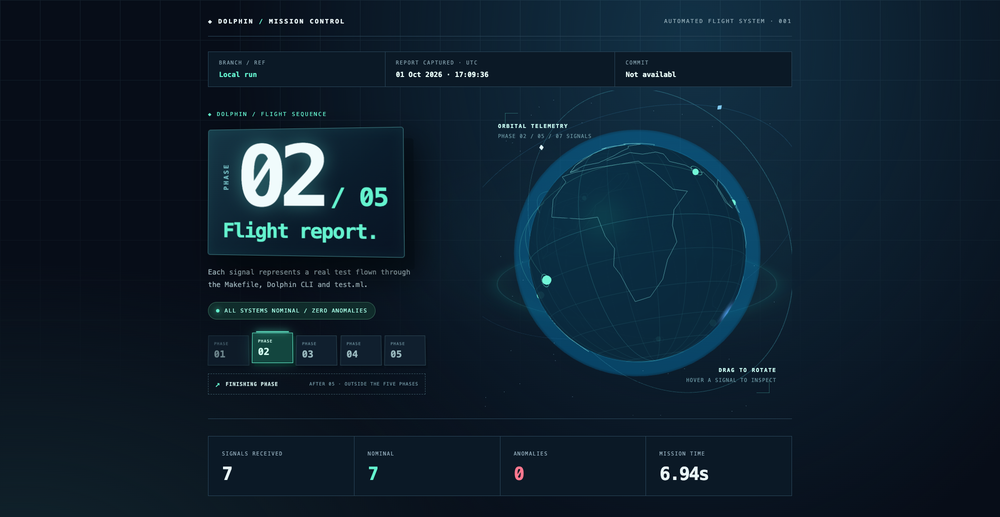

# Dolphin Flight Report

An interactive mission-control dashboard for the Dolphin compiler test suite. Follow the current phase, inspect test results and source programs, and explore the 3D telemetry globe.

**[Open the flight report →](https://omikkel.github.io/dovs-dolphin-flight-report/flight-report/)**
